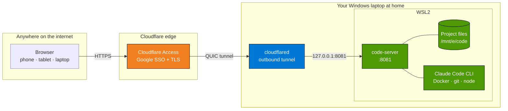

# Remote VS Code via WSL + Cloudflare Tunnel

> Turn your Windows laptop into a personal dev cloud. Access your development environment from any browser, anywhere, secured with Google SSO — no VPN, no paid SaaS, no code leaving your machine.

## Architecture at a glance



**Zero inbound ports** on your router — the tunnel is outbound-only. **Zero code** leaves your laptop — Cloudflare only transports encrypted traffic. **Zero passwords** to manage — Google SSO handles auth at the edge.

Open `https://dev.yourdomain.com` on a phone, a Chromebook, a friend's laptop — anything with a browser — authenticate with your Google account, and you're inside VS Code editing the exact same files you left open on your home machine. Claude Code, Docker, extensions, terminal, everything.

## What you get

- **Full VS Code in the browser** — not a crippled web IDE, the real thing, running `code-server` in WSL2 with access to your entire project tree
- **Google SSO at the edge** — Cloudflare Access gates every request before it reaches your laptop
- **Zero inbound ports on your router** — Cloudflare Tunnel is outbound-only, so your home network exposes nothing
- **Auto-start on logon** — Windows Task Scheduler brings up WSL, code-server, and the tunnel without you touching anything
- **Claude Code ready** — run Anthropic's CLI coding agent in the integrated terminal with your Claude Max plan
- **Open VSX marketplace** — install extensions like Python, Docker, GitLens, Jupyter, etc.
- **$0/month** — Cloudflare Tunnel and Access free tier cover this entire setup

## Who this is for

Developers who:

- Work on a Windows desktop or laptop and occasionally want to code from somewhere else without lugging the machine
- Want a "GitHub Codespaces-like" experience on hardware they already own
- Are comfortable with PowerShell, WSL2, and basic networking
- Care about not having their source code sitting on a third-party cloud IDE

## Quick links

- 📘 [Full setup guide](docs/SETUP.md) — step-by-step, ~45 minutes end to end
- 🏗️ [Architecture](docs/ARCHITECTURE.md) — how the pieces fit together
- 🔒 [Security notes](docs/SECURITY.md) — what's protected and what isn't
- 🩺 [Monitoring & auto-heal](docs/MONITORING.md) — the watchdog that keeps the stack up
- 🧱 [Reliability](docs/RELIABILITY.md) — per-component failure modes and permanent solutions
- 🧪 [RCA log](docs/RCA.md) — every bug fixed, with root cause and prevention
- 🛠️ [Troubleshooting](docs/TROUBLESHOOTING.md) — every error I hit and how I fixed it
- ❓ [FAQ](docs/FAQ.md)

## Prerequisites

- Windows 10/11 with WSL2 installed
- A domain name on Cloudflare (any TLD — `.dev`, `.in`, `.com`, etc.)
- A free Cloudflare account
- A free Google account (for the SSO Access policy)

## Repository layout

```text
.
├── windows/                    # Files that live on Windows
│   ├── auto-start.ps1          # PowerShell orchestration script
│   └── cloudflared-config.yml  # Cloudflare Tunnel ingress config (template)
├── wsl/                        # Files that live inside WSL
│   ├── start-code-server.sh    # Launches code-server with Open VSX gallery
│   └── code-server-config.yaml # code-server config (template)
├── docs/
│   ├── SETUP.md                # Full install guide
│   ├── ARCHITECTURE.md         # How it works
│   ├── SECURITY.md             # Threat model + hardening
│   ├── TROUBLESHOOTING.md      # Known issues & fixes
│   └── FAQ.md
└── README.md
```

## Install in 5 steps (condensed)

Full details in [docs/SETUP.md](docs/SETUP.md). The short version:

1. **Install code-server in WSL** and drop `wsl/start-code-server.sh` at `/home/<user>/start-code-server.sh`
2. **Install `cloudflared` on Windows**, create a tunnel, and drop `windows/cloudflared-config.yml` at `C:\Users\<you>\.cloudflared\config.yml` (edit the hostname)
3. **Put `auto-start.ps1`** at `E:\code\auto-start.ps1` (or wherever you prefer — update paths)
4. **Register a Task Scheduler task** at logon pointing to the PS1
5. **Add a Cloudflare Access application** with a Google SSO policy for your hostname

Reboot. Open your hostname. You're in.

## Acknowledgments

- [coder/code-server](https://github.com/coder/code-server) — the workhorse
- [Cloudflare Tunnel](https://developers.cloudflare.com/cloudflare-one/connections/connect-networks/) — free outbound-only ingress
- [Open VSX](https://open-vsx.org/) — the open-source extension registry that replaces Microsoft's marketplace for forks
- [Anthropic Claude Code](https://docs.claude.com/en/docs/claude-code/overview) — the AI coding agent that runs in the terminal

## License

MIT — see [LICENSE](LICENSE).
